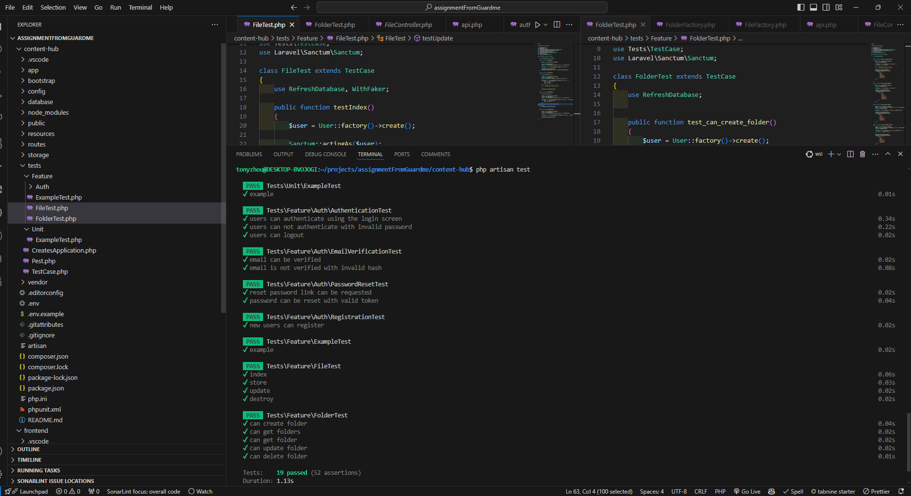

## This backend app is developed using Laravel framework.
## Project setup 

0. Install Dependencies
run ```composer install``` 
```
composer install
```
if you haven't installed composer, run ```apt install composer``` 
```
apt install composer
``` 
or other command tool to install.

1. Set up local run environment
```
mv .env.example .env
```
in .env file, you need to update two variables, APP_KEY, DB_DATABASE
run ```php artisan key:generate``` to create new APP_KEY, it will update the variable automatically
Modify db directory according to yours: 

```
php artisan key:generate
```

```
DB_DATABASE=/home/tonyzhou/projects/content-hub-backend/content-hub/database/database.sqlite
```


2. Setup Database
In this project, for demo convenience we use built in memory db sqlite, under the database folder, create a new database file called database.sqlite
run ```php artisan migrate``` to initialize the database.
```
php artisan migrate
``` 

3. Check api list and run the application
run ```php artisan route:list``` to check api lists
```
php artisan route:list
``` 
run ```php artisan serve``` to run the application locally
```
php artisan serve
``` 

4. Have created some test cases for folder and file test
   
   
5. Now you should be good for the test from the frontend.

