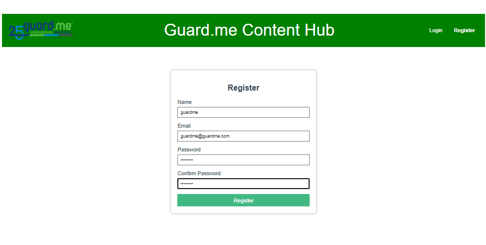
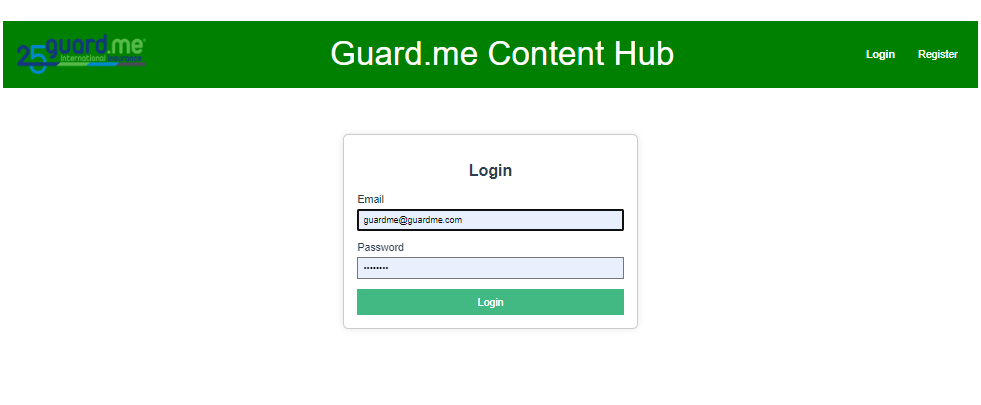
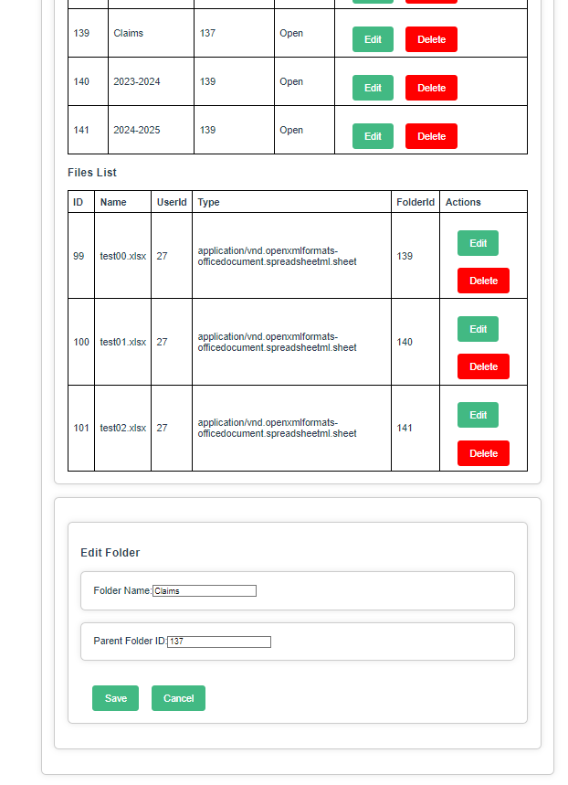
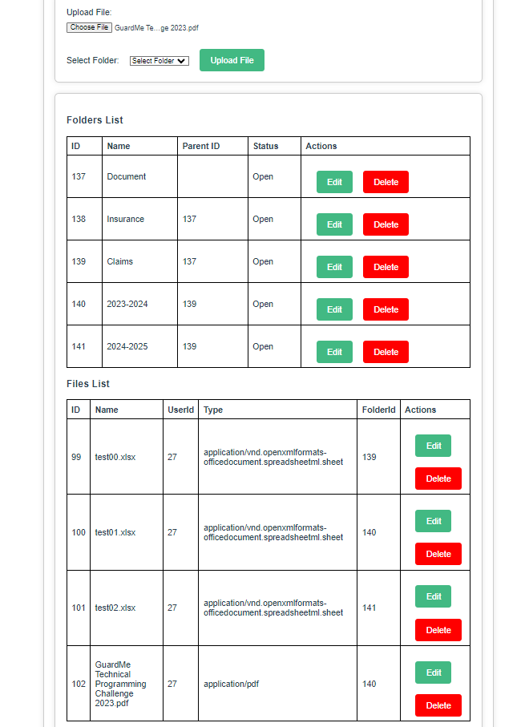

# file-management
Go to frontend directory and run the following commands:
1. ### Project setup, install all dependencies the project needs
```
npm install
```

2. ### Compiles and hot-reloads for development
```
npm run serve
```

3. ### Open browser and go the app running url, you will go to main page and then register new user or login.
```
  App running at:
  - Local:   http://localhost:8080/
```
1. Register new user


2. After registration, it will automatically redirect to the login page, then login with your user


3. Use the createFolder section to create new folder, when creating you can set its parent folder or just leave it as non parent. then you'll see the folder in the Folder List, here still some issue, the folder without parent will show immediately but the folders with parent have to refresh then you'll see it. Also the parent selection options seems some folder duplication.
   

If you want to edit the folder info, you can change its name and parent id here, click the edit button then a modification window will show and you can update there and then save the updates. or you can delete the folder by clicking delete button on that folder line.



4. Use the file upload section to upload files, only pdf,txt and microsoft office format accepted.

